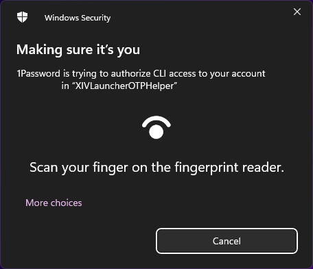

# 1Password CLI OTP Scripts

  

These scripts (based on [kensykora's automatic OTP entry](https://gist.github.com/kensykora/b220573b4230d7622c5a23a497c75fd3)) allow you to keep your OTP secret secure inside a 1Password vault and use Windows Hello to approve requests for the 6 digit code.

## Requirements
1. 1Password 8 (You might be able to use 7, but then you'll need to log into the CLI separately)
2. [1Password CLI](https://1password.com/downloads/command-line/)
3. [PS2EXE](https://github.com/MScholtes/PS2EXE) (Optional)

## Getting Started
1. After installing the requirements above, you'll want to choose whether you want to see the main screen of the launcher ([manual-login.ps1](/misc/1password-cli-otp/manual-login.ps1)) or just log into the game ([automatic-login.ps1](/misc/1password-cli-otp/automatic-login.ps1)). The automatic log in script has fewer side effects as it's not waiting for the port to open, but you miss out on the news posts.
2. Make sure line 4 of either script matches your vault item's name. It is "Square Enix" by default.
3. Check "Enable XL Authenticator app/OTP macro support" in Settings and if you're using the automatic login script, check "Log in automatically" on the main launcher screen.
4. (Optional) Win-PS2EXE allows you to convert the script into an executable. This has the added benefit of being able to be pinned to the taskbar with Windows 11, but it also provides more context in the Windows Hello prompt by using the exe name you choose instead of the generic "powershell" requesting access. **Note: Windows Defender and other anti-virus software will likely take issue with these built exes so ensure they are approved for use.**

## Known Issues
- In some instances the Windows Hello prompt will minimize itself. I believe this is due to 1Password itself being minimized.
- In some instances the script will fail to retrieve an OTP. Unlocking the vault before running the script is a workaround for the time being.